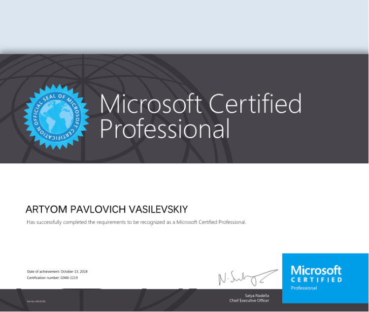

## [RSS School](https://rs.school/ "Сайт")
___
# Artem Vasilevsky
## My Concat Info:
- **Email**: vasilevskiy.art@gmail.com
- **Telegram**: @ArtyomVas
- **Discord**: @Vasashock
___
## About me:

Hello! I really like to programming! I have experience in C#, SQL and some others programming languages!

I don't have enough knowledge, experience about Web programming, iclude HTML,CSS, JavaScript.

I think RS School can help to have a good basement for Web-programming.

___
## Skills:
- C#
- SQL, TSQL
- VS Stuidio
- VS Code
- Git
- GitHub
- GitLab
- Microsoft Dynamics CRM 
- OOP 
- .NET
___
## Code Example:
HackerRank: 2D Array - DS

___
## Courses:
- Exam 483: Programming in C#

___ 
## Languages:

- Russain - Native
- English - Intermediate