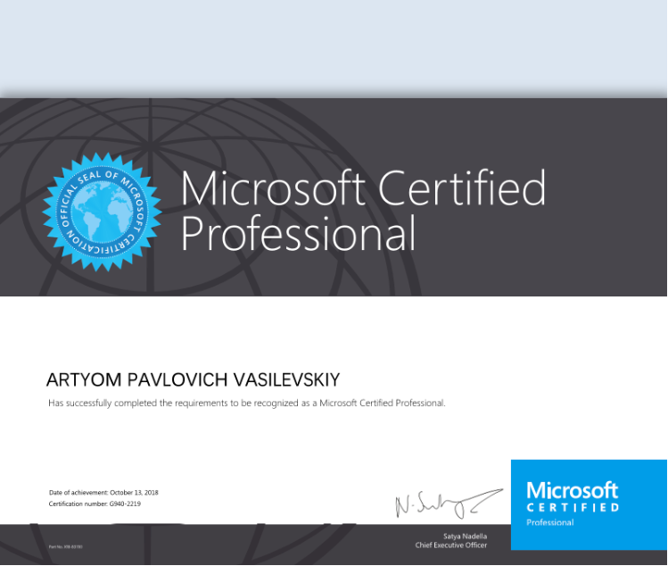

# [RSS School] (<https://rs.school/> "Сайт")

---

## Artem Vasilevsky

### Contact Information

- **Email**: <vasilevskiy.art@gmail.com>
- **Telegram** : @ArtyomVas
- **Discord**: @Vasashock

---

### About Me

Hello! I really like to programming! I have experience in C#, SQL and some others programming languages!
I don't have enough knowledge, experience about Web programming, iclude HTML,CSS, JavaScript.
I want to level up my skills and improve experience Web Tech/
I think RS School can help to have a good basement for Web-programming.

---

### Skills

-C#
-SQL, TSQL
-VS Stuidio
-VS Code
-Git
-GitHub
-GitLab
-Microsoft Dynamics CRM
-OOP
-.NET

---

## Code Example

CodeWars: Multiply

```javascript
function multiply(a, b){
  return a * b;
}
```

---

## Courses

- Exam 483: Programming in C#



---

## Languages

- Russain - Native
- English - PreIntermediate
